# Solution Builder User Manual

Solution Builder turns a problem you can describe into working software. You
describe the problem once. A series of specialist agents then drafts the
documents a software project needs, one stage at a time, and you approve
each one before the next begins. No agent ever approves anything. The
decisions are yours.

This manual is for the people who use the app. It covers installing and
starting it, connecting a model, running a project through its nine stages,
and the settings that shape the work. If you want to know how the app is
built, read [ARCHITECTURE.md](ARCHITECTURE.md) and
[IMPLEMENTATION.md](IMPLEMENTATION.md) instead.

## Contents

1. [How it works](#how-it-works)
2. [Installing and starting](#installing-and-starting)
3. [First run](#first-run)
4. [The Projects page](#the-projects-page)
5. [The top bar](#the-top-bar)
6. [The project workspace](#the-project-workspace)
7. [Working with a specialist](#working-with-a-specialist)
8. [Approving a stage and sending one back](#approving-a-stage-and-sending-one-back)
9. [The nine stages](#the-nine-stages)
10. [Documents, exports, and backups](#documents-exports-and-backups)
11. [The project menu](#the-project-menu)
12. [Settings](#settings)
13. [The desktop app and the host](#the-desktop-app-and-the-host)
14. [Troubleshooting](#troubleshooting)
15. [Keyboard reference](#keyboard-reference)
16. [What the app does not do yet](#what-the-app-does-not-do-yet)

## How it works

A project moves through nine stages. Each stage has a specialist that drafts
one document, asks you questions one at a time, and revises the draft as you
answer. When the document is right, you approve it. Approval is recorded
against that exact version. The next stage then opens with everything
approved so far.

| | Stage | What it produces | What you decide |
|---|---|---|---|
| 1 | Problem discovery | Problem brief | Enough has been captured |
| 2 | Solution shape | Constraints | The bounds are accepted |
| 3 | Solution proposal | Chosen approach, with the alternative kept | One approach is picked |
| 4 | GUI design | Mockups, interaction notes, acceptance criteria | The design is accepted |
| 5 | Concept approval | One package and slide deck per stakeholder | Each stakeholder proceeds |
| 6 | Build plan | Product requirements and a build plan, with reviews | The plan is accepted |
| 7 | Cost approval | A firm estimate | The spend is approved and the plan is frozen |
| 8 | Build and test | Working software and build evidence | The evidence is accepted |
| 9 | Deliver | Delivery manifest | The delivery is accepted |

A few rules hold throughout:

- **You hold every gate.** Nothing advances until you approve it.
- **Approvals name exact versions.** If a document changed after you read
  it, the approval is refused and you see the newer version.
- **Nothing is deleted.** Every version of every document is kept. Sending a
  stage back marks later work as stale but erases nothing.
- **Secrets stay on your machine.** API keys and sign-in tokens live in your
  keychain. They never appear in a document, a log, or a prompt.
- **Work continues when the window is closed.** The app runs a background
  host. Closing the window hides it. The specialists keep working until they
  reach the next point that needs you.

## Installing and starting

### The desktop app

Solution Builder ships as a macOS app for macOS 13 or newer. Open the `.dmg`,
drag the app to Applications, and launch it. Builds are not signed or
notarized yet, so macOS may ask you to confirm opening the app the first
time.

On launch the app starts its background host, waits for it to be ready, and
opens a window. The first start takes longer than later ones because the host
unpacks its database. The window reads "Starting…" while it waits. After a
while it may read "Still starting. The host is taking longer than usual to
bring up the hub." That is normal on a first run.

A tray icon appears in the menu bar while the app runs. Its menu has two
items:

- **Open Solution Builder** shows the window again.
- **Stop the host and quit** stops the background host and closes the app.

Closing the window with the red button only hides it. The host keeps
running. Use the tray item, or quit the app, to stop it for real.

### Running from source

If you have the repository instead of the packaged app, follow the steps in
the [README](../README.md). In short: install [Bun](https://bun.sh) 1.4 or
newer, run `bun install`, then `bun run dev`. The host prints a launch URL
and opens it in your browser. Everything in this manual applies the same way
in a browser tab, except for the tray icon and the system dictation features
of the desktop shell.

## First run

The first time you open the app it walks you through setup. Setup has up to
five short steps. A progress track across the top shows where you are.

### Welcome

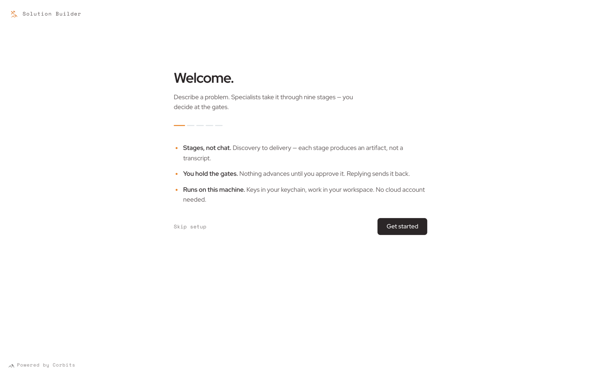

The welcome screen explains the three ideas behind the app: stages instead
of chat, gates that you hold, and work that runs on your own machine. Click
**Get started**, or **Skip setup** to jump straight to connecting a provider.

### Look

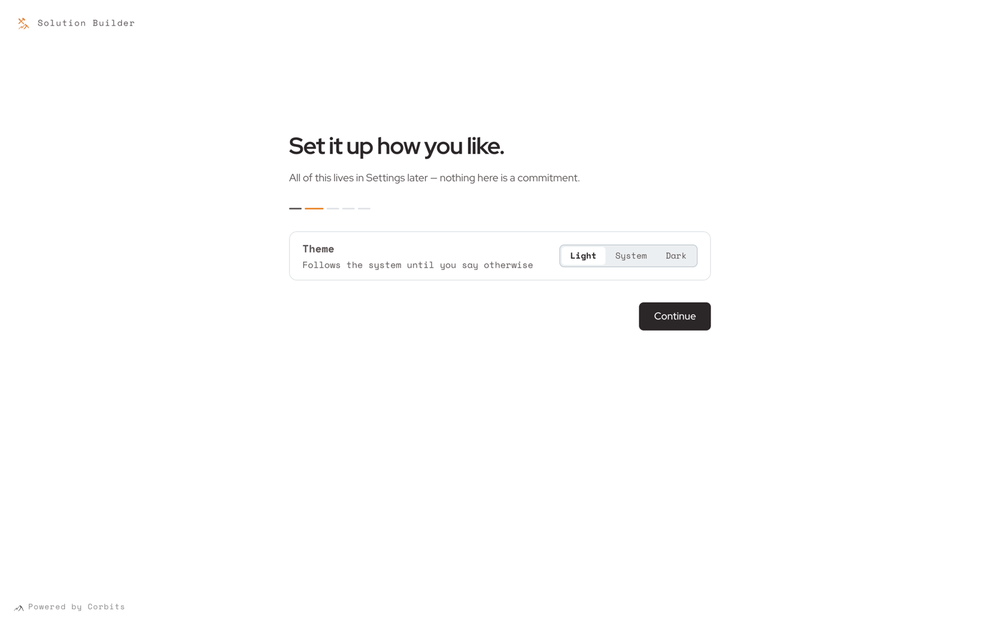

Pick a **Theme**: Light, System, or Dark. You can change it later in
Settings. Click **Continue**.

### Connect a provider

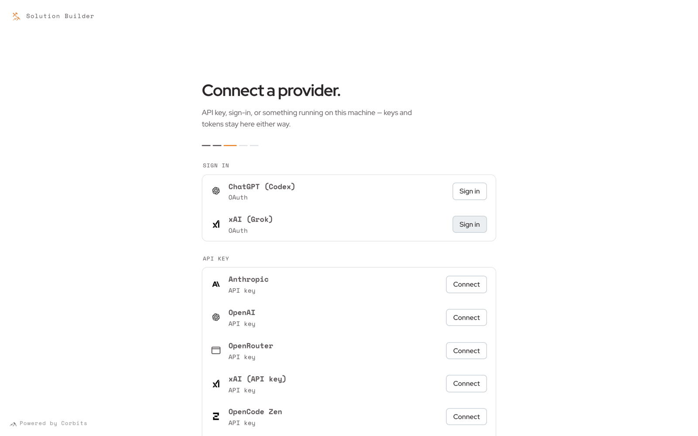

The specialists need a model to think with. You connect one of these:

- **Sign in** with a subscription you already pay for: ChatGPT (Codex) or
  xAI (Grok). Click **Sign in**. Your browser opens. The row reads "Waiting
  for the browser" until you finish. If the browser did not open, a banner
  shows the link to copy.
- **API key** for Anthropic, OpenAI, OpenRouter, xAI, OpenCode Zen, or an
  OpenAI-compatible endpoint. Click **Connect**, paste the key, and click
  **Connect** again. The key is checked against the provider before it is
  kept, and it is never shown again.
- **On this machine**: Ollama. Click **Detect**. If Ollama is running, the
  row reads "N models on this machine". If not, it reads "Not detected —
  start Ollama, then retry".
- **Custom**: any other server that speaks the OpenAI protocol. Click **Set
  up** and enter its endpoint URL.

A connected row reads **Connected**. Click **Continue**. You cannot continue
without at least one connected provider, because the app cannot draft a
stage without a model. **Skip for now** leaves setup, but the app returns
to this step until a provider is connected.

### Choose a default model

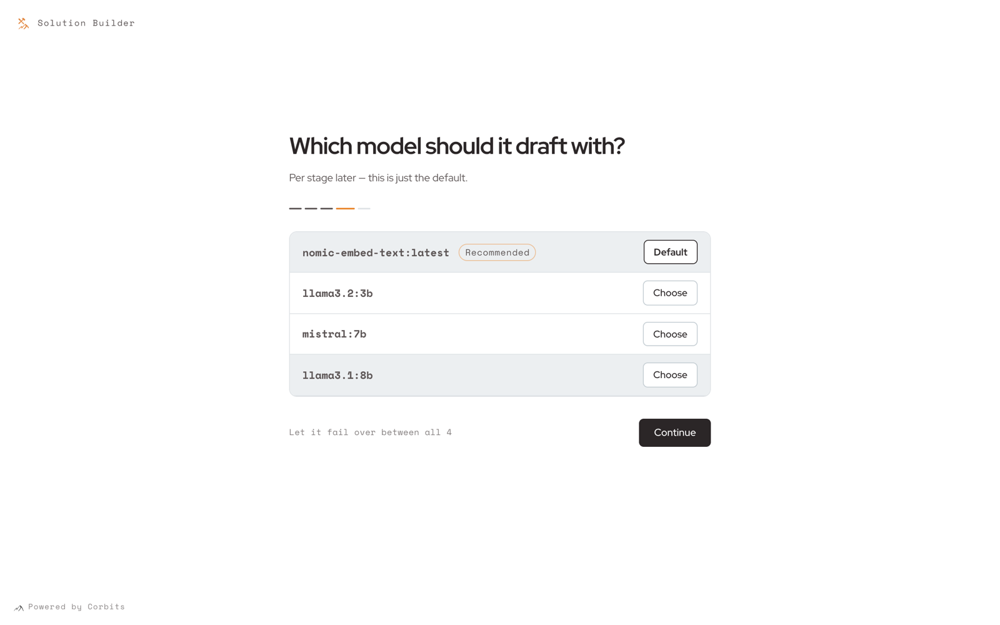

If the provider serves more than one model, the app asks which one to draft
with. Click **Choose** beside one and then **Continue**, or click **Let it
fail over between all N** to let the app try them in order. You can change
this per stage later from the Inference menu in the workspace.

Pick a model that writes text well. An embedding model, such as
`nomic-embed-text`, cannot draft a document even if it appears in the list.

### Describe your first problem

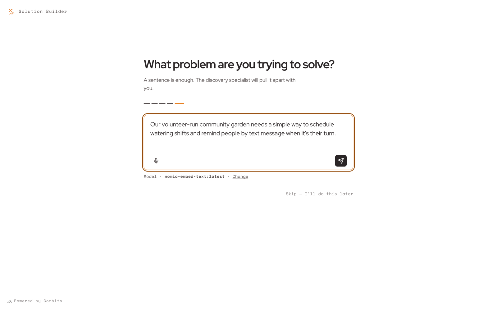

Type a sentence or two about the problem you want solved. Ten characters is
the minimum. The microphone button lets you dictate instead. Press Enter or
click the send button, and the project opens on its first stage.

The line under the box names the model that will draft. Click **Change** to
pick another. Click **Skip — I'll do this later** to go to the Projects page
without creating a project.

## The Projects page

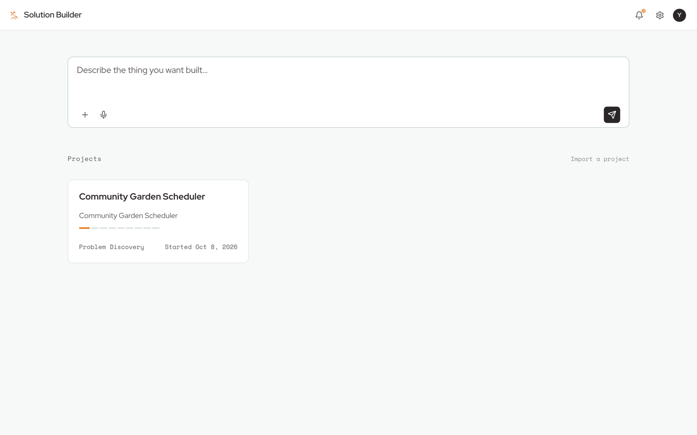

The Projects page is the home screen. The box at the top starts a new
project. Describe what you want built and press Enter. You can attach files
with the **+** button or by dropping them onto the box. They become
material for the first draft. The new project opens right away.

Each project is a card. A card shows:

- the project title, with a **…** button for the project menu;
- the first line of the original problem statement;
- a nine-segment track showing how far the project has come;
- the current stage name, or "Delivered" when the project is finished;
- whose turn it is: "Your turn · a question is waiting", "Your turn · ready
  for your approval", "Specialist working", or the date it started.

A card that needs a decision carries a **Needs decision** badge and sorts to
the top. Click a card to open it. Right-click or long-press a card to open
its **Project info** dialog.

Archived projects collapse into a fold at the bottom labeled "N archived".
Expand it to see them.

**Import a project**, at the right of the "Projects" heading, brings in a
project that this app exported. See
[Exporting and importing a project](#exporting-and-importing-a-project).

## The top bar

The top bar is the same on every screen, with a few extra controls inside a
project.

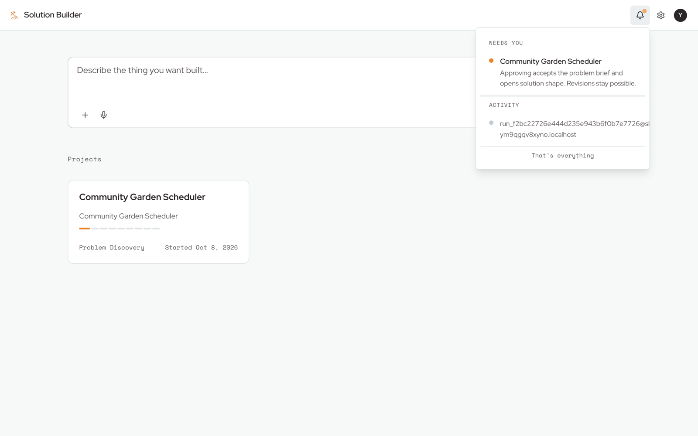

From left to right:

- **Back arrow.** Inside a project it reads "All projects" and returns to
  the Projects page. In Settings it returns to wherever you came from.
- **Project title.** Click it to open the project menu, the same one the
  card's **…** button opens.
- **Stage track.** Nine segments. Finished stages are solid and clickable.
  Click one to read that stage's document without leaving the current
  stage. The current stage is wider and colored. The name under the track
  is the current stage, or "<Stage> · viewing · at <current stage>" while
  you read an earlier one.
- **Download Document Package.** Saves every finished document as one zip.
  See [Downloading the document package](#downloading-the-document-package).
- **Bell.** A dot on the bell means something is waiting. Open it to see two
  groups. "Needs you" lists each decision waiting on you, with what
  approving it would do. Click one to open that project. "Activity" lists
  messages from the app's own inbox. When nothing is waiting it reads
  "Nothing waiting on you."
- **Gear.** Opens Settings.
- **Initials.** Your account. The menu shows your name and email, with
  **Account settings…** and **Sign out**.

The app does not show system notifications. The bell is where to look.

## The project workspace

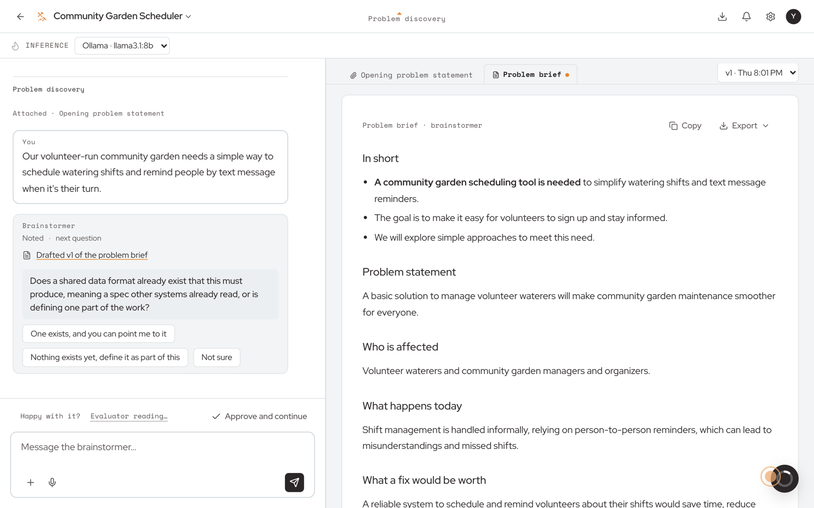

A project opens on its current stage. The workspace has three parts.

**The Inference row** sits under the top bar. It names the provider and
model this stage is drafting with. The flame icon moves while the specialist
is working. Open the dropdown to switch models. See
[Changing the model](#changing-the-model).

**The conversation** is the left pane. The specialist's messages appear here,
with the question it is asking and quick-answer buttons when it offers
choices. The message box is at the bottom. Above the box is the gate: the
"Happy with it?" line and the **Approve and continue** button.

**The document** is the right pane. The tabs along the top are every
document in the project so far, one per stage, plus any files you attached.
A dot marks the current stage's document. The dropdown at the right of the
tabs picks a version. Under the tabs is the document itself, with **Copy**
and **Export** controls.

Drag the divider between the panes to resize them. Double-click it to reset.
Below about 900 pixels of width the panes stack instead.

### The opening wait

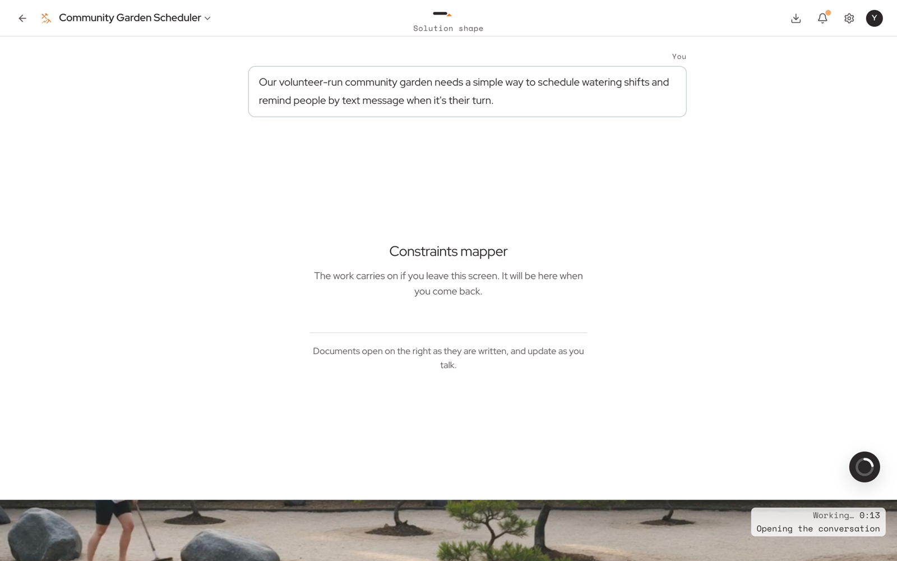

When a stage opens, its specialist reads everything approved so far and
begins drafting. Until the first draft lands, the workspace shows a single
column: your opening statement, the specialist's name, and the line "The
work carries on if you leave this screen. It will be here when you come
back." Tips rotate underneath. A first draft usually takes a minute or two.
The GUI design stage takes longer, often five to ten minutes.

### The zen garden

While the app is working, a strip along the bottom of the window shows a
garden being raked, with a clock and a line saying what is being done, such
as "Brainstormer is redrafting the brief". It appears after about a second
of waiting and goes away when the work is done. Drag its top edge to change
its height, or double-click the edge to reset it.

Turn it off in Settings under Appearance. With it off, the same line shows
as one line above the message box.

### The guide in the corner

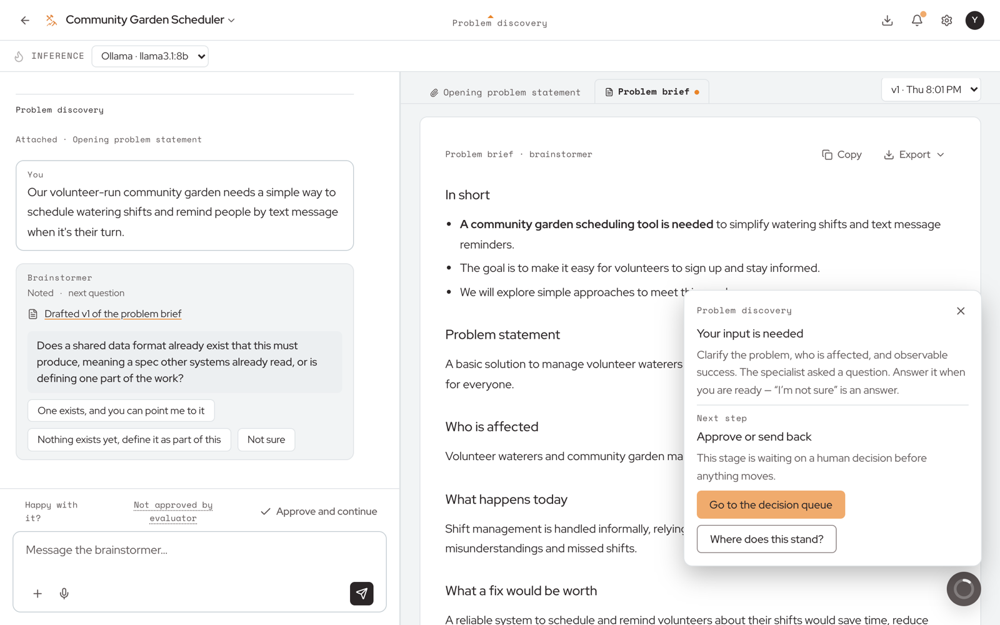

The ring in the bottom-right corner shows progress through the nine stages.
Hover it to see the stage and the next step. Click it to open the **What
happens next** panel, which says where the project stands, what is being
waited on, and what to do next. When the next step is somewhere else, a
button takes you there: **Go to the decision queue**, **Open artifacts**,
**Open settings**, or **Take me there**.

**Where does this stand?** asks the product guide agent for a fuller
answer. It reads the project's documents and replies with what is still
missing, your options, and a recommendation. The guide only advises. It
cannot write a document or make a decision for you.

### The first-run tour

The first time you open a project at each stage, a short tour points at the
parts of the screen that matter for that stage. Use **Next**, **Back**,
**Skip**, and **Got it**. The tour runs once per stage per browser. There is
no button to replay it.

## Working with a specialist

### Answering questions

The specialist asks one question at a time. Type an answer in the message
box and press Enter. Shift+Enter adds a line without sending.

When the specialist offers answers, each one is a button under the question.
Click one to send it as written, or type your own. When it asks several
questions at once, clicking an option adds it to the message box, and the
reply sends once every question has an answer.

The draft on the right is revised after every answer. The conversation
shows "Drafted v2 of the problem brief" with each new version. Click that
line to open the version it names.

While the specialist is writing, the send button becomes a red **Stop**
button. Stopping puts your text back in the box. The turn stays in the
conversation, dimmed, marked "Stopped before it was answered."

You can type while the specialist is still writing. The message waits and
goes when the draft lands. The cue reads "Held until the specialist
finishes, then sent."

### Pointing at part of a document

Select a passage in the document on the right. A small box opens with
**Comment on this passage** and an **Add to chat** button. Add a note if
you want, then click **Add to chat**. The passage attaches to your next
message as a quote, with your note, so the specialist knows exactly what you
mean. Attached passages show as chips above the message box. Click a chip's
remove button to drop it.

### Attaching files

Click **+** beside the message box to attach files. Accepted kinds are text,
Markdown, CSV, JSON, HTML, Excel, Word, PowerPoint, PDF, images (PNG, JPEG,
GIF, WebP), and zip archives. A zip is unpacked, and only the readable files
inside are kept.

The specialist reads text, spreadsheets, and the text of PDF, PowerPoint
`.pptx`, and Word `.docx` files. Images, scanned PDFs, and the older binary
`.doc` and `.ppt` formats are kept with the project but not read. The
specialist says so, rather than pretending it saw what it did not. Files
over 10 MB are refused.

A file attached after a stage has started goes to that stage's specialist
as soon as it is free. The conversation shows "Attached <file>" with a fold
that reveals what the specialist was given.

### Changing the model

The **Inference** dropdown above the conversation lists every connected
provider and model in the order Settings tries them. Choosing one makes it
the default and switches this stage to it. The stage's specialist restarts
on the new model and is handed the conversation and the current draft. A
divider in the conversation reads "This stage continues on <Provider> ·
<model>."

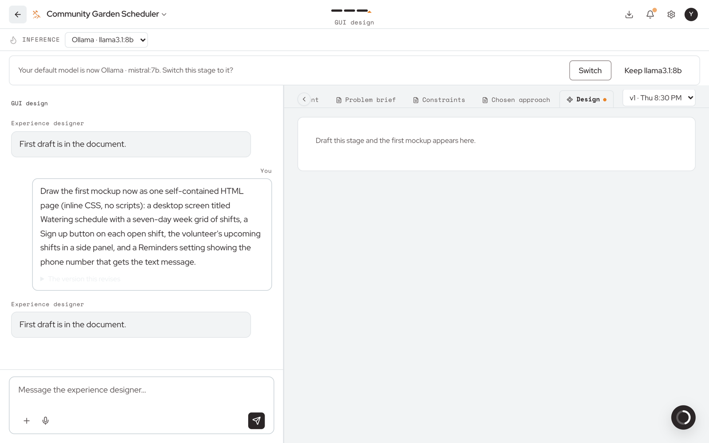

If you change the default elsewhere, an open stage asks "Your default model
is now <provider · model>. Switch this stage to it?" with **Switch** and
**Keep**.

If a provider refuses a request, the next one in your preferred order is
tried. A local endpoint never falls back to a cloud one.

### Dictation

Every message box has a microphone button. Click it to dictate. The button
reads "Starting the microphone… If macOS asks, allow it." and then
"Listening:" with a waveform. Words are added to whatever you already
typed. Click the microphone again to stop, or stop speaking for a moment.
The desktop app uses Apple's speech recognizer. If permission is missing, a
dialog offers to open the right System Settings pane.

## Approving a stage and sending one back

### Approving

The gate sits above the message box. When you are the only person who can
approve the stage, it reads "Happy with it?" with an **Approve and
continue** button. When someone else holds that authority, it reads "Nothing
more to say?" with **Send for approval**. There is no mode to set. The app
reads it from who holds the role.

Approving records your decision against the exact version on screen and
opens the next stage. If the document changed since you read it, the
approval is refused and the newer version is shown.

In Problem discovery, a brief evaluator reads each draft and gives an
opinion beside the button: "Evaluator reading…", "Approved by evaluator", or
"Not approved by evaluator". Click it to read the evaluator's notes. The
opinion is advice. The decision is still yours.

The button is hidden while you are reading an older version or another
stage's document.

### Sending back

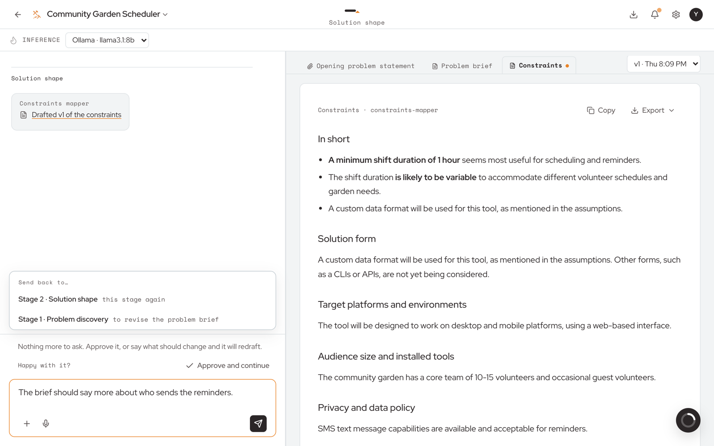

If something earlier was missed, send the project back. Type the reason in
the message box, then **press and hold** the send button for about half a
second. A picker opens, **Send back to…**, listing every stage from the
current one down to the first. Each row says what returning there is for:
"to revise the problem brief", "to change the solution bounds", and so on.
Pick one.

A reason is required. Without one, the app replies "Say why <stage> is being
sent back, so its specialist knows what to change."

You can also send back from an earlier stage's document. Click a finished
segment on the stage track, then click **Change it: send back to <stage>…**
in the document header. A card asks for the reason and confirms with **Send
back to <stage>**.

Afterward, the project stands at the stage you named. Its specialist
receives the reason and the draft that was sent back, and revises it. Each
stage between there and where you were is walked again, with each specialist
revising its current document rather than starting over. Every version and
approval from before stays in the record.

## The nine stages

Each stage has its own specialist, document, and gate. This section says
what to expect at each one.

### Problem discovery

**Specialist:** the Brainstormer. **Document:** the problem brief.

Describe what hurts. The Brainstormer interviews the problem, not a
solution. It writes the brief while you talk and asks one question at a
time: who is affected, what happens today, what a fix is worth, what counts
as success. Answer in your own words or tap an offered answer. "Not sure"
is an answer.

A brief evaluator reads each version and says whether it looks complete.
When you are satisfied, click **Approve and continue**. Approving opens
Solution shape with the brief as its material.

### Solution shape

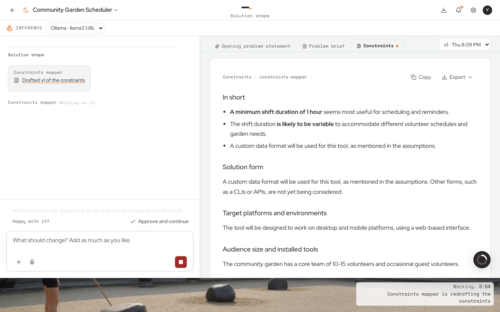

**Specialist:** the Constraints mapper. **Document:** the constraints.

This stage bounds the solution: the form it takes, the platforms it must run
on, the audience, privacy and data rules, integrations and credentials,
installation and deployment, support expectations, data sources, and
non-goals. The document ends with "What I need from you", a list of open
questions with offered answers. Approving fixes the bounds the next stages
design within.

### Solution proposal

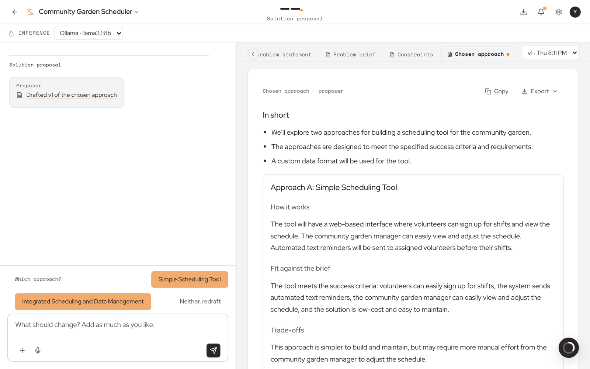

**Specialist:** the Proposer. **Document:** the chosen approach.

The Proposer writes two approaches and compares them on the same criteria:
how each works, its fit against the brief, trade-offs, risks, and
assumptions. The document lays them out side by side.

The gate first asks "Which approach?" with one button per approach and a
**Neither, redraft** option. Picking one tells the Proposer, which rewrites
the document around that approach and keeps the other as a rejected
alternative. Then **Approve and continue** appears as usual.

### GUI design

**Specialist:** the Experience designer. **Document:** the design.

The designer draws the product's screens as working mockups, with
interaction notes and the acceptance criteria a build will be measured
against. A first design takes five to ten minutes. The right pane shows the
screens in frames: a browser window for desktop screens, an iPhone for phone
screens. The **Frame** dropdown forces every screen into a desktop window, a
phone, or the plain pane. **Copy HTML** and **Print or save as PDF** sit
beside it.

Feedback on a design is anchored to the part of the screen it is about:

1. Switch **Mode** from Preview to **Feedback**. The cursor becomes a
   crosshair and elements outline as you hover.
2. Click the element you want changed. Type a comment and click **Add this
   comment**. Repeat for each point.
3. Choose an overall direction: **Revise this design**, **Choose this design
   as it stands**, **Combine with another version**, or **Reject this
   direction**. Add a note to the designer if you want.
4. Click **Submit feedback and generate the next version**.

The designer answers with a new version and a table of your comments, each
marked Open, Addressed, or Declined. Messages typed in the conversation go
to the designer too.

Drawing a mockup takes a capable model. A small local model may answer
without one, in which case the pane reads "Draft this stage and the first
mockup appears here." and no approval gate appears. Ask the designer again,
or switch the stage to a stronger model from the Inference menu.

When the design is right, click **Approve and continue**. Approving fixes
the design every later check is measured against. Its screens become the
pictures in the next stage's slides.

### Concept approval

**Specialist:** the Presentation creator. **Documents:** one package per
stakeholder, each with a slide deck.

This stage secures buy-in. Every stakeholder gets a decision request written
in their own terms, with a numbered deck outline that the app turns into
slides.

**Stakeholders.** A line above the packages reads, for example, "You ·
Finance lead · 2 must proceed". Click **Manage stakeholders** to add rows.
Each row has a name, a role (project owner, budget approver, technical
approver, audience member, builder operator, or delivery recipient), and a
**Remove** button. **How many must proceed** sets the quorum. Click **Save
stakeholders**. A new project starts with one stakeholder, "You", and a
quorum of one.

**Packages.** Each stakeholder's package is a tab. A stakeholder without one
is listed with a **Write it** button; **Write all N** writes every missing
package at once. **Write it again** redrafts one package and leaves the
others as they stand. Asking for a rewrite in the conversation does the
same.

**Slides.** Under each package is its deck. Use the arrows or the arrow keys
to move between slides, and click the large slide to play them full screen.
The cover names the stakeholder and role. One slide follows per outline
item, and a closing slide lists the decisions to make. Slides carry the
approved design's screens as pictures. An outline item with no text under it
becomes a slide that is only a screen.

**Export slides** offers **Save as PPTX**, **Save as PDF** (through the
print dialog, one page per slide), and **Open in Google Slides**. Google
Slides needs a Google Drive connection in Settings. Without one, the
PowerPoint file is saved instead and a notice explains how to import it.
The saved PowerPoint carries each slide's full text as speaker notes.

**Decisions.** Under each deck, the stakeholder records **Proceed**, **Needs
revision**, or **Reject**, with an optional note. A chip per stakeholder
shows the votes. Rewriting a package makes earlier votes on it stale; the
stakeholder decides again on the new version. The gate reads "N of M have
proceeded." with the reason it is waiting, and **Approve and continue**
enables once the quorum is met with no reject or revise outstanding.

When "You" is the only stakeholder, the gate reads "You're the only
stakeholder. Happy with it?" and one click records your Proceed and the
approval together.

### Build plan

**Specialists:** the Requirements author, the Requirements explainer, the
Architect, and four reviewers. **Documents:** product requirements, the PRD
for people, the build plan, and the reviews.

The stage opens by gathering what the first four stages agreed into one
product requirements document, with an id on every requirement and
acceptance criterion. The Architect then writes the build plan against
those ids. The plan opens with a table, "How it will actually run": how it
is started, where it runs, who it is for, what it needs, its ongoing cost,
and whether it is shared or in the cloud.

The **Build plan document** picker switches between the documents:

- **Product requirements**: the requirements with their ids.
- **PRD for people**: the same requirements written for a human reader, with
  the design's screens as pictures. It is rewritten automatically whenever
  the requirements or the design change.
- **Application review**, **Quality review**, **Platform review**, and
  **Security review**: four independent reviews of the plan.

Request a review from the plan's **Request review** menu, or open a review
and click **Request review**. **Request again** reruns it. Reviews advise.
They never block approval.

Approving names the build plan version. Before it allows that, the app
checks that the plan's Stack section exists and that every part cites valid
requirement ids. If not, the gate offers **Ask the architect to resend it**
or **Send the architect the current ids**.

### Cost approval

**Specialist:** the Estimator. **Document:** the cost estimate.

The Estimator converts the accepted plan into a firm estimate. Every figure
assumes a coding agent writes the code: cost is inference spend plus what
the software costs to run, and time is the agent's wall-clock plus the
gates. Nothing is priced in engineer-days.

Above the message box, **How will this be used?** asks for the delivery
target:

- A command you run in a terminal (not verified yet)
- A website (verified today)
- A service other software calls (verified today)
- An app you install (not verified yet)

A website or a service is started and checked when the build is published.
The other two are not checked yet, and the app says so. A target is
required before the stage can be approved.

The top of the document summarizes the estimate as a table of labels,
amounts, and the basis for each, followed by a checklist of what was priced
and the "How it will actually run" table.

Approving authorizes the spend against this exact plan and **freezes the
build packet**: the approved version of every earlier stage, the chosen
target, and the plan's stack. The document then carries an "Approved ·
frozen" badge and a line per frozen stage. Nothing frozen can change. To
change it, send the project back to Cost approval or earlier, which clears
the freeze.

### Build and test

**Specialist:** the Build supervisor. **Worker:** the coding agent chosen in
Settings. **Document:** the build status and the build evidence.

The build runs on your computer, using a coding agent you have installed
and signed in to: Corbits Code by default, or Claude Code or Codex. Choose
it under **Build worker** in Settings. The panel heading reads "Build
Evidence", with a state badge, the tool name, the attempt number, an
elapsed clock, and the spend so far.

The toolbar shows only the buttons that can act right now:

- **Start the build attempt** starts the first attempt in a fresh directory
  from the frozen plan.
- **Cancel the build attempt** stops the worker and anything it started.
  There is no timeout. A build takes as long as it takes.
- **Restart the build from the beginning** starts a new attempt in a fresh
  directory. Earlier attempts' directories are kept.
- **Continue from attempt N** starts from a copy of that attempt's
  directory, commits included, with your note in its packet. The note goes
  in the box labeled "For the worker, on the next attempt". The
  conversation on the left goes to the Build supervisor, not the worker.
- **Record attempt N and brief the supervisor** packages the attempt's
  directory into a `.tar.gz` archive, records it as the build evidence, and
  asks the Build supervisor to write the build status.
- **Download attempt N's archive (.tar.gz)** saves that archive.
- **Approve and continue** appears once an archive is recorded and nothing
  is running.

While the worker runs, its output streams into the pane "Attempt N — what
the worker wrote", exactly as the process writes it. A worker with a
lifecycle hook (Corbits Code) also reports each turn and the tools it
called. The **Build progress** section shows a headline, the attempt's
directory on disk, a meter of the plan's tasks, and whether the worker left
a `README.md`, a `docs/USER-MANUAL.md`, a `STATUS.md`, and a `QUESTIONS.md`
of decisions it left to you. Answer those through the note on the next
attempt.

When the worker ends, its exit status is shown but is not a verdict. Read
what it left, and record the attempt, try again, or continue from it. The
same four panel reviews are available here against the build evidence.

Optional **Start command** and **Port** fields tell the record step how to
start the built software and which port to probe. Left blank, the brief
says the target was not probed.

### Deliver

**Specialist:** the Delivery verifier. **Document:** the delivery manifest.

The manifest lists the delivered files with sizes and hashes, the verifier's
summary, and a "How to run it" section. **Download the app (.tar.gz)** saves
the archive. Unpack it with `tar -xzf <file>` and follow its README.

**Delivery verification** is a checklist with three states: passed, failed,
and unverified. Only checks the tool actually ran count as passed. Anything
the model merely claimed is marked "reported by the agent, not checked". A
website or service target is started and probed. A terminal command or an
installable app is reported as not exercised.

Type any feedback in the box, then click **Accept** or **Reject**.
Accepting marks the project delivered; its card on the Projects page reads
"Delivered". Rejecting records your feedback for the verifier and sends the
project back to Build and test. The send-back takes its reason from the
message box in the conversation pane, so type what should change there as
well. If the message box is empty, the app asks you to fill it in and send
back again.

## Documents, exports, and backups

### Reading documents and versions

Every document the project has produced is a tab above the right pane,
across all stages. The dropdown beside the tabs lists versions as "v2 · Thu
8:06 PM". A superseded version says so. Pick one to read it.

While reading the current stage's document, a **Changes since vN** switch
shows what changed from the previous version: insertions underlined,
removals struck through. While reading a superseded version, the gate
offers **Make it the active version**, which copies that content forward as
a new latest version. Nothing is overwritten.

Click a finished segment on the stage track to read that stage's document.
The header reads "<Stage> · <Document> · viewing" with **Back to <current
stage>** and **Change it: send back to <stage>…**.

### Exporting a document

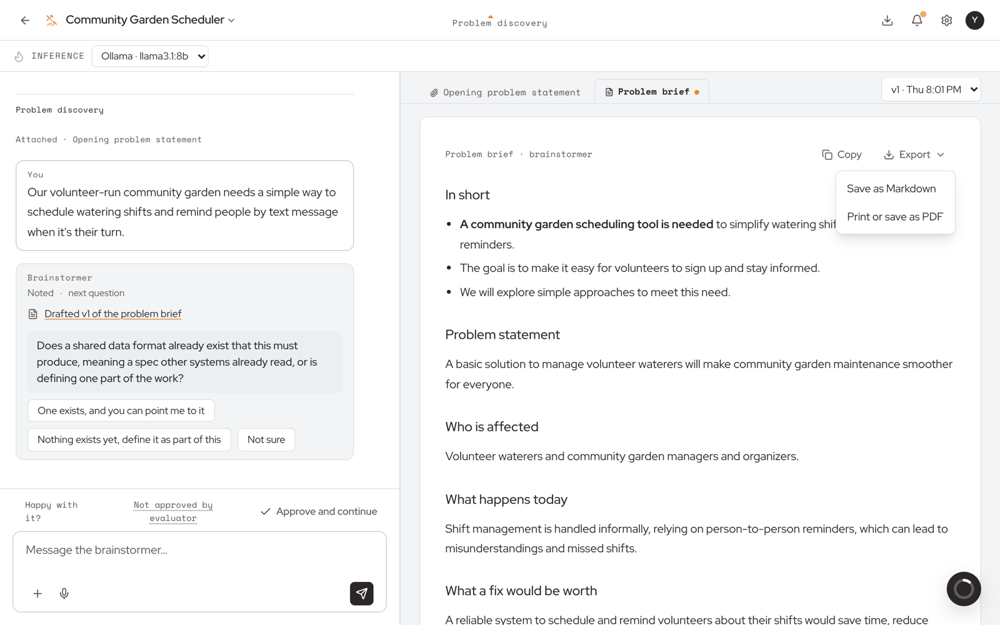

Each document has **Copy** and **Export**. Export offers:

- **Save as Markdown**, named `<project>-<document>.md`.
- **Print or save as PDF**, which opens a print layer with the document laid
  out for paper and a header naming the stage, version, and date. Use the
  system print dialog to print or save a PDF. Press Esc to return.

A design prints from its own frame. A slide deck exports as PowerPoint or
PDF from the Concept approval stage.

### Downloading the document package

The download icon in the top bar, and **Download documents…** in the
project menu, save the newest version of every finished document as one
zip named `<project>-documents.zip`. Text documents are Markdown, the
design is HTML with its screens as PNG files in a `mockups` folder, and
slide decks are PowerPoint. A README inside lists what is there. Uploaded
material, design feedback, build evidence, and the delivery manifest are not
included.

### Exporting and importing a project

**Export…** in the project menu saves the whole project as one JSON file
named `<project>.solutions-builder.json`. It carries the title and settings,
every version of every document, each stage's conversation, every decision,
and each stakeholder's vote. It never carries providers, API keys, tokens,
or session data.

**Import a project** on the Projects page accepts that JSON file, or a zip
containing exactly one. The import always creates a new project titled
"<title> (imported)". It never merges with an existing one, so importing a
file twice gives two copies. The recorded decisions are replayed so the new
project stands at the same stage, and each stage's conversation becomes a
read-only document called "<Stage> conversation (imported)". The receiving
app connects its own provider.

### Backing up

Everything lives in one data folder, listed under **This computer** in
Settings. Copy that folder to back it up. Also keep the keychain items the
app created (service `com.corbits.solutions-builder`), because stored
provider keys cannot be read without the credential encryption key. For a
single project, **Export…** is the portable copy.

## The project menu

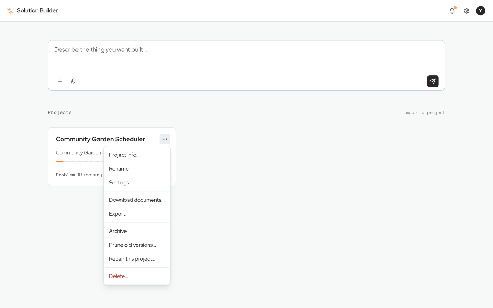

Open it from a card's **…** button or from the project title in the top
bar.

- **Project info…** opens a dialog with the name, when it was created, last
  activity, where it stands, how many artifacts and runs it holds, its
  usage, and a count of decisions. **Export…**, **Archive**, and **Save**
  sit at the bottom.
- **Rename** opens the same dialog with the name field focused. Enter saves.
  Esc reverts.
- **Settings…** opens this project's own settings: whether its slide decks
  use the workspace's design documents, and its own design documents. See
  [Design documents](#design-documents).
- **Download documents…** builds the document package.
- **Export…** saves the project file.
- **Archive** moves the project into the "N archived" fold. Archived
  projects never show in the bell. **Unarchive** brings one back.
- **Prune old versions…** archives older document versions, keeping the
  newest of each document and every version a decision names. The first
  click shows the plan; the second confirms. Nothing is deleted.
- **Repair this project…** rebuilds the project's workflow from every
  recorded decision. Use it if the project appears stuck at a stage that
  does not match its approvals. It asks twice.
- **Delete…** removes the project from every list. It asks twice. The
  record and its documents are kept behind the scenes, but there is no
  button to bring a deleted project back, so prefer **Archive**.

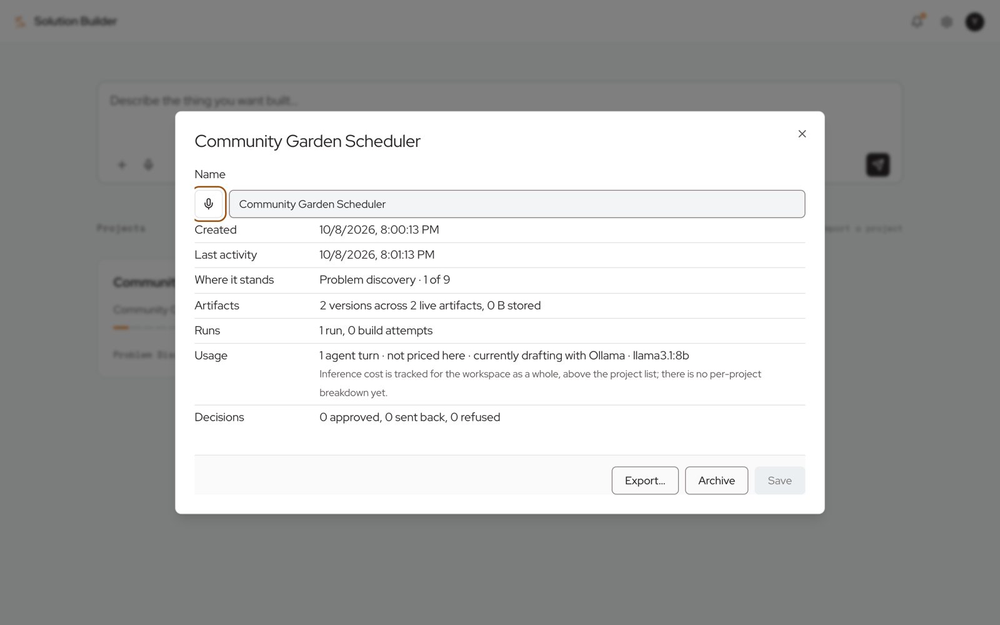

## Settings

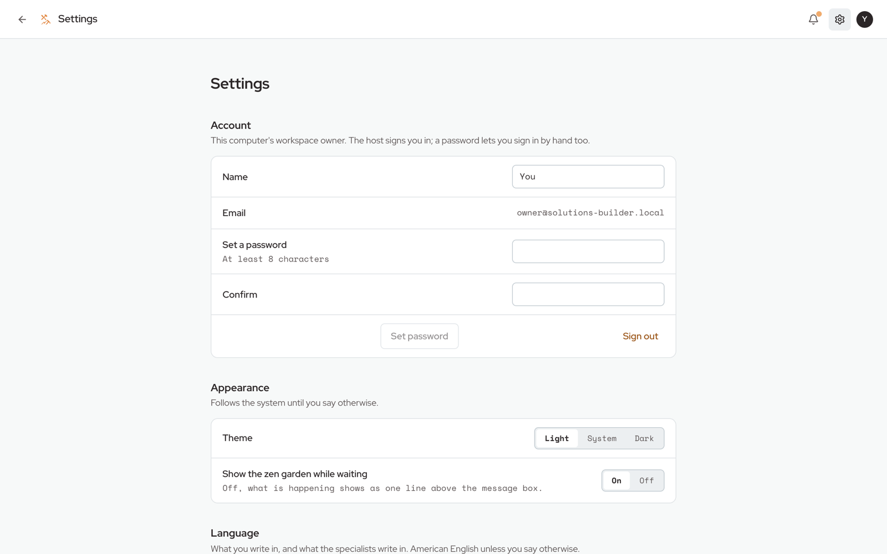

Open Settings with the gear in the top bar. Every control saves itself:
toggles when clicked, menus when changed, text fields when you press Enter
or leave the field. The **Back** arrow returns to where you were.

### Account

The desktop app signs you in as this computer's workspace owner. You can
set a **Name**, and **Set a password** so you can also sign in by hand. The
email is fixed. **Sign out** ends the session; the sign-in screen then
offers **Continue as this computer's owner**.

### Appearance

**Theme**: Light, System, or Dark. **Show the zen garden while waiting**:
On or Off. Both are stored in this browser or window, not in the workspace.

### Language

**Input language** is what you write in. **Output language** is what the
specialists write in: every document, reply, and the text of any software
built. American English is the default. British English is also supported
for output. Spanish, French, and German can be chosen as input languages.

### Inference

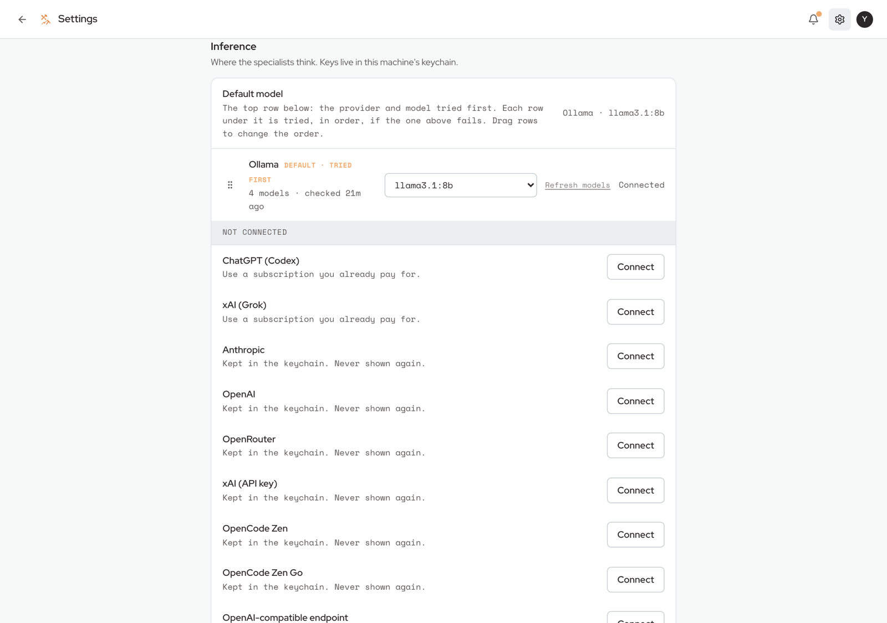

This section lists every provider the app can use and the order they are
tried. The **Default model** row names the one tried first.

Connected providers come first, each with a drag handle. The top row is
tagged "Default · tried first"; lower rows read "Tried 2nd if the one above
fails" and so on. Drag a row, or focus its handle and use the arrow keys,
to change the order. Home puts a row first. Unconnected providers sit under
a "Not connected" divider.

A connected row shows the model count and when it was last checked, a model
dropdown, and **Refresh models**, which pulls the provider's list again.
Choosing a model moves it first for that provider; the rest stay as
fallbacks. A row with a problem reads "Needs attention" with a **Reconnect**
button.

To connect a provider, click **Connect** on its row. API-key providers ask
for the key and check it against the provider's own model list before
keeping it. Sign-in providers open your browser. Ollama and other local
servers ask for an endpoint, pre-filled with Ollama's default
`http://localhost:11434/v1`.

There is no disconnect button. Reconnecting a provider replaces its
connection.

### Designer

What the GUI design specialist draws to. **Surface** is Light, Dark, or
whatever the brief calls for. **Design language** is free text in your own
words, such as a palette, a typeface, or a tone. The designer follows it
over its own defaults. Changes apply the next time the designer starts.

### Build worker

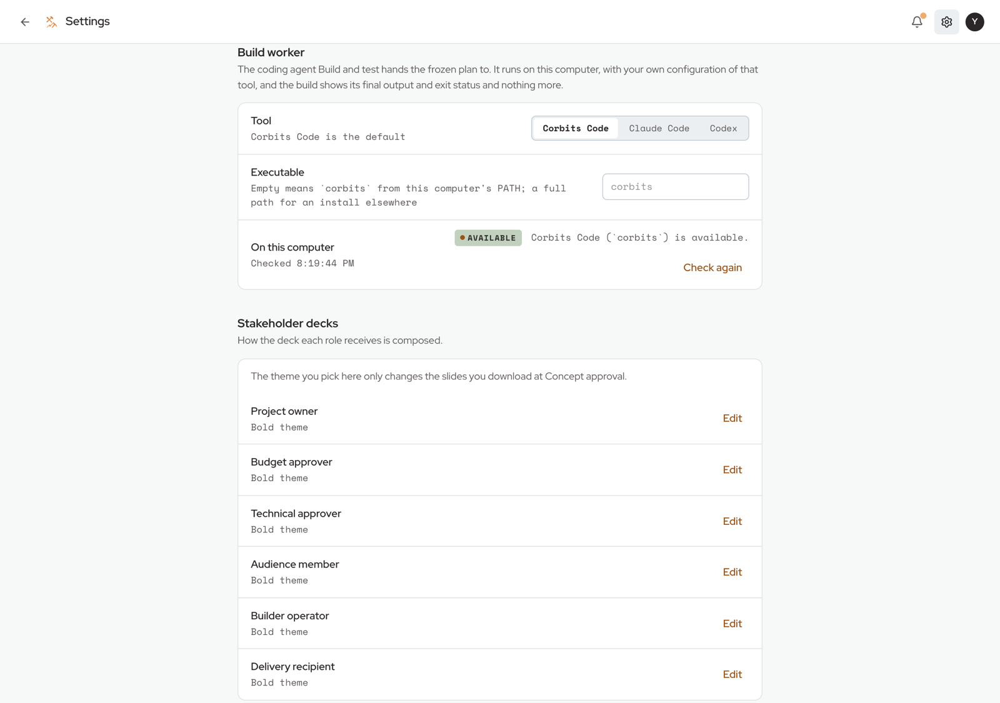

The coding agent that Build and test hands the frozen plan to. **Tool** is
Corbits Code, Claude Code, or Codex. **Executable** is empty to use the
tool's command from this computer's PATH, or a full path to an install
elsewhere. **On this computer** reads "Available" or "Not found", with
install instructions and a **Check again** link. Changes take effect on the
next build attempt.

Each tool runs with your own sign-in and configuration for that tool. The
app never passes a permission-skipping flag.

### Stakeholder decks

One row per role: project owner, budget approver, technical approver,
audience member, builder operator, and delivery recipient. Click **Edit**
to pick that role's **Theme**: Minimal, Detailed, or Bold. The theme changes
the slides you download at Concept approval.

### Design documents

Design documents shape every stakeholder deck. Click **Add design
documents…** and choose text or Markdown guidelines, or an existing
presentation as PowerPoint or PDF. Each listed file says what is read from
it:

- Text: read as written and handed to the presentation creator.
- PDF: its text, plus its page size and colors, which draw the slides.
  Typefaces cannot be read from a PDF.
- PowerPoint: its slides' text, and its theme, which draws the slides.

The first file that carries a theme decides how the slides look. A project
can add its own design documents from its menu under **Settings…**, and can
turn the workspace's off for that project. A project's own documents always
apply and come first.

### Google Drive

Where **Open in Google Slides** puts a deck. Paste an OAuth client id and
secret from the Google Cloud Console, as the hint on the page describes,
then click **Connect Google Drive**. The status reads "Connected as
<email>." **Disconnect** removes it.

### This computer

Facts about the host: whether the connection is local or remote, where
credentials are kept (macOS Keychain, or a private file on disk when no
keychain is available), the data folder, and the app version.

## The desktop app and the host

The host is the part that does the work. The window is only how you watch
it. That is why closing the window does not stop a build or a draft. When
the specialists reach a decision that needs you, it waits for you in the
bell.

### Where data lives

| Platform | Default |
|---|---|
| macOS | `~/Library/Application Support/SolutionsBuilder` |
| Windows | `%APPDATA%\SolutionsBuilder` |
| Linux | `$XDG_DATA_HOME/SolutionsBuilder` or `~/.local/share/SolutionsBuilder` |

Inside it: the database under `pglite`, build workspaces under
`builds/<project>/attempts/<n>`, one log per build attempt beside its
directory, and the build worker setting. Set `SOLUTIONS_BUILDER_DATA_DIR`
before launching to use a different folder.

Secrets go to the macOS login keychain under the service
`com.corbits.solutions-builder`. Where no keychain is available, they go to
a private file in the data folder, and Settings says so under **This
computer**.

### Starting over

There is no reset button. To start fresh, quit the app, delete the data
folder, and relaunch. For a complete wipe, also delete the keychain items
under that service. To keep the old data and start a second workspace,
point `SOLUTIONS_BUILDER_DATA_DIR` at a different folder instead.

### Logs

The host writes its log to the app's own standard error, so it is visible
when the app is started from a terminal. Each build attempt also has its own
log file beside its directory in the data folder.

## Troubleshooting

**"The host is not answering."** The background host has stopped or has not
finished starting. Wait a moment. If it persists, quit with the tray's
**Stop the host and quit** and relaunch.

**"The host is answering slowly: about N s per request."** Everything on the
page waits on the host. The host's log names which requests are slow.

**"The host did not start."** The host exited before it was ready. The
window shows the reason it gave. A locked keychain is a common cause: the
host refuses to mint new keys rather than make existing credentials
unreadable. Unlock the keychain, or allow the app access, and start it
again.

**Onboarding keeps appearing.** The app returns to setup whenever no
provider is connected. Connect one, or check under Inference in Settings
for a row that reads "Needs attention".

**"Not detected — start Ollama, then retry."** Ollama is not answering on
its default port. Start it and click **Retry**.

**A key is rejected.** The row shows the provider's own message, for example
"The provider rejected this key (HTTP 401)". Check the key and reconnect.

**"This key works, but the provider did not list any model this product can
use."** The account has no suitable model. Pick another provider.

**The specialist stopped.** A banner reads "The specialist had stopped, so
your message was not delivered." A fresh specialist starts with the
conversation so far, and your message is back in the box. Send it again
once the specialist is ready.

**"<Specialist> was started without the project's record."** Click **Brief
the specialist now**. The stage cannot be approved until it has the record.

**"This project's workflow was updated, and one earlier decision no longer
holds under the new rules."** The app's rules changed since that decision
was recorded. The project stands where the new rules put it. Take the
decision again if it is still wanted.

**A build tool is "Not found".** Install it as the message under **Build
worker** describes, or enter its full path in **Executable**, then click
**Check again**. An app launched from the Finder may have a shorter PATH
than your terminal, so the full path is the reliable choice.

**Dictation does nothing.** The desktop app needs microphone and speech
recognition permission, and macOS Dictation or Siri turned on. The dialog
that appears offers to open the right System Settings pane.

**The project seems stuck at the wrong stage.** Use **Repair this
project…** in the project menu to rebuild the workflow from its recorded
decisions.

## Keyboard reference

| Where | Keys | Action |
|---|---|---|
| Message box | Enter | Send |
| Message box | Shift+Enter | New line |
| Pane divider (focused) | ←/→, Shift for larger steps | Resize |
| Pane divider (focused) | Home / End | Smallest / largest |
| Pane divider | Double-click | Reset |
| Zen garden edge (focused) | ↑/↓ | Resize |
| Zen garden edge | Home or double-click | Reset |
| Guide panel, popovers, print layer | Esc | Close |
| Slides | ←/→, ↑/↓, PageUp/PageDown | Previous / next slide |
| Slides | Home / End | First / last slide |
| Slides | Space or Enter | Play |
| Slide player | Space | Advance |
| Slide player | Esc | Close |
| Provider row handle (focused) | ↑/↓ | Reorder |
| Provider row handle (focused) | Home | Move first |
| Project card | Enter or Space | Open |
| Rename field | Enter / Esc | Save / revert |

There are no global shortcuts.

## What the app does not do yet

The app says what it cannot observe rather than drawing it. These are the
gaps today:

- **Build and test runs one supervised command.** There is no per-agent
  roster, no steering of a running worker, and no checkpoint resume. The
  worker's output is shown as it is, not parsed into steps.
- **Delivery evidence is not verified byte for byte.** The manifest exists.
  Hash checks against an install target do not.
- **Terminal commands and installable apps are not exercised** by delivery
  verification. Websites and services are.
- **No system notifications.** Decisions waiting on you appear in the bell
  inside the app, not as macOS notifications.
- **No per-project cost figure.** The Project info dialog counts agent
  turns. The only dollar figure shown is the estimated spend of a build
  attempt.
- **Branches are in the record but not the interface.** Only the main
  branch is used.
- **Signing, notarization, and Windows** are not done.
